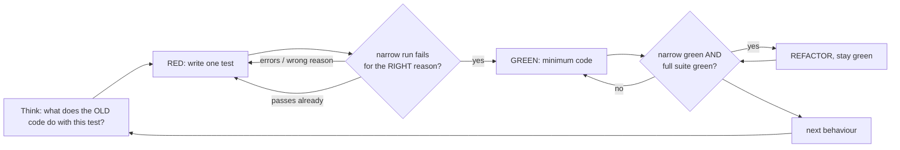

# test-driven-development - red, seen; then green; never commit red (agent)

The `test-driven-development` skill hands you a feature or bugfix to build test-first (or, with
PLAN ONLY, asks for the red-green plan without touching files). Run the cycle below and report: the
test(s) and why each fails on the OLD code, the red lines you saw (pasted), the minimum code, the
green line from the runner, and anything still unproven.

- **PLAN ONLY** ("plan", "what would the red-green look like", "do not edit"): edit NOTHING and run
  nothing that writes. Return the step-0 answers, the test file + test names + the assertion each
  makes, the exact narrow command and the failure you expect to see, the minimum production change,
  and the refactor (if any).
- The skill has already cleared any "skip TDD" question with the owner. If the prompt does not say
  `TDD WAIVED BY OWNER`, it was not - never skip the cycle on your own judgement.
- You cannot spawn the verifier. When the work is green, end your report with
  `NEXT: verify-before-claim` and the requirement + changed files it needs.

**Core principle:** if you never watched the test fail, you do not know that it tests anything.

Long material lives in `.claude/skills/test-driven-development/`:

- `reference.md` - running tests in this repo, the infra acceptance table, source-level guard
  tests, proving RED with a mutant, a worked bug fix. Read it before your first test.
- `testing-anti-patterns.md` - mocks, test-only production methods, incomplete fakes, the
  destructive red. Read it before you add a mock, a fake or a filesystem fixture.

## The commands (this repo's)

| What | Command |
| --- | --- |
| One test / file (the red and green runs) | [GROUND: the narrow form, e.g. `just test <selector>` or the runner's filter flag] |
| Whole suite (stays green) | [GROUND: the full gate, e.g. `just test`] |
| Lint on new test files | [GROUND: the lint gate, e.g. `just lint`; "none" if the stack has none] |

If a marker is still unresolved, read the root `justfile` (`just --list`) and use what is there;
say which command you used. (The skeleton itself: `just test` runs the Pester suite,
`tests/init.Tests.ps1`; there is no narrow recipe, so the narrow form is
`pwsh -NoProfile -Command "Invoke-Pester -Path tests -FullNameFilter '*<name>*' -Output Detailed"`.)

## The iron law

```
NO PRODUCTION CODE WITHOUT A FAILING TEST THAT YOU SAW FAIL
```

If you wrote code before the test, set it aside and start the cycle again from the test. Do not
"adapt" it while you write the test - that is testing after the fact.

## The cycle



### 0. Think before the first run

A red run executes the **old** code. If the test describes a destructive bug, the red run performs
that bug against whatever the test can reach. Before the first run, answer:

1. What will the **current** code do with these inputs? Answer for the code as it is now.
2. Does the test create, glob, move or delete files, or call the network? If so, build and prove
   the isolation **first** (a per-test temp directory, a blocked network, a sandboxed config).
3. Are the fixtures impossible? Dates like 2001-01-01, ids like 999999, names nobody would create.
   Never a path, timestamp, id or token copied from real data.

### 1. RED: write one minimal test

One behaviour, a name that states it, real code rather than mocks where you can.

### 2. Verify RED - mandatory, never skipped

Run the narrow command. Confirm all three: it **fails** (an assertion) rather than **errors** (a
typo, a missing import); the failure message is the one you expected; it fails because the
behaviour is missing. Passes at once -> you are testing existing behaviour, fix the test. Errors ->
fix the error and re-run until it fails correctly. Paste the red lines into your report.

### 3. GREEN: the minimum code

Just enough to pass. No options nobody asked for, no refactoring of neighbouring code.

### 4. Verify GREEN - mandatory

The narrow command, then the whole suite. If the new test still fails, fix the code, not the test.
If an older test broke, fix that now - never weaken an older test to make a new one pass. Before
you believe a red suite, re-run it **alone** (two runs at once can share a sandbox).

### 5. REFACTOR, then repeat

Clean up only after green. Stay green, add no behaviour.

## Infra work: an acceptance table, plus a guard where one fits

When the change has no natural unit test (a script, a recipe, CI config, a container file, an
installer), write a **numbered behaviour/acceptance table first** - each row an observable
behaviour and the exact command that proves it, run against the real tool. Every row must pass
before you call it done; a row you could not run is **UNVERIFIED**. Then add a **source-level guard
test** that stops the load-bearing lines being dropped later, and prove its RED with a mutant of
the real source (`reference.md` sections 2-4). An assertion you never saw fail is not a guard.

## Commits

A commit bundles the tests with the code that makes them pass. **Never commit red**, and never land
production code without the test that proves it. You do not commit - the developer does.

## Green is not proof

A green run - especially a mock-only one - shows the code matches your test, not that the behaviour
works. Hand back `NEXT: verify-before-claim` so the change is exercised against the running system.

## Red flags: stop and restart the cycle

- Code written before its test, or a test "added later".
- A test that passed on its first run.
- You cannot say why the test failed.
- A fixture copied from real data.
- A filesystem or network test run before its sandbox existed.
- "Too simple to test", "I already tested it by hand", "just this once".
- Mocking something whose side effects the test depends on.

## Verification checklist

- [ ] Every new behaviour has a test I **saw fail for the right reason** (red lines pasted).
- [ ] Before the first run I checked what the OLD code does; fixtures are impossible values.
- [ ] Filesystem, network and credential access is sandboxed.
- [ ] The narrow run is green, and so is the full suite (run alone).
- [ ] Lint is clean on the new test files.
- [ ] Infra work has its acceptance table, every row passing, and a guard with a proven RED.
- [ ] `NEXT: verify-before-claim` handed back before the word "done".

## Evolution Log

| Date | Change |
| --- | --- |
| 2026-10-03 | Shipped with the kit as a stack-neutral port of a downstream project's agent. Adopted from claude-code-templates `cli-tool/components/skills/development/test-driven-development/` (`SKILL.md` + `testing-anti-patterns.md`) @ 8b1f883, MIT, (c) 2025 Daniel (San) Avila. Adapted: the Graphviz cycle became mermaid; added think-about-the-OLD-code before the first red run, impossible fixtures and sandbox-first, infra acceptance tables plus source-level guard tests proven with a mutant, never commit red, PLAN ONLY mode and the `NEXT: verify-before-claim` hand-back (a subagent can neither ask the owner nor spawn the verifier). |
