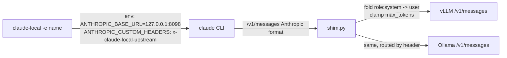

# claude-local: Claude Code on self-hosted model servers

Run the **same** Claude Code binary against self-hosted models served by vLLM or Ollama
instead of Anthropic's API. Nothing global changes: `claude` keeps using Anthropic,
`claude-local` uses your servers, and every variable is set only for the `claude-local` process.

```powershell
claude-local                 # default endpoint; falls back to the next reachable one
claude-local -e ollama       # a specific endpoint (no fallback)
claude-local --list          # every endpoint: reachable?, model, context
claude-local -p "..."        # print mode; any claude argument passes through
claude-local --no-mcp        # drop every MCP server for this session (see Known limits)
just claudel                 # same, with --dangerously-skip-permissions (project justfiles)
```

## Table of contents

1. [Install](#install)
2. [Endpoints](#endpoints)
3. [Files](#files)
4. [How it works](#how-it-works)
5. [Why a shim is needed](#why-a-shim-is-needed)
6. [Known limits](#known-limits)
7. [Operations](#operations)

## Install

Requirements: Claude Code, Python 3 (on PATH, or managed by `uv`), PowerShell 7, and at least
one server whose Anthropic-style `/v1/messages` endpoint you can reach (vLLM 0.19+, Ollama).

```powershell
# from a clone of project-skeleton: the first endpoint is called "main" and becomes the default
pwsh tools/claude-local/install.ps1 -Upstream http://vllm-host:8000

# add more endpoints, one per run (name, model, context are per endpoint)
pwsh tools/claude-local/install.ps1 -Name docker -Upstream http://127.0.0.1:8100
pwsh tools/claude-local/install.ps1 -Name ollama -Upstream http://127.0.0.1:11434 -Model qwen3.5:4b -Context 32768
pwsh tools/claude-local/install.ps1 -Name ollama -Default     # change the default

# from the web (Windows PowerShell 5.1 is fine)
& ([scriptblock]::Create((irm https://raw.githubusercontent.com/dxiiren/project-skeleton/main/tools/claude-local/install.ps1))) -Upstream http://vllm-host:8000

# as part of the machine bootstrap
initial-setup.ps1 -LocalLlmUpstream http://vllm-host:8000
```

Then open a **new** terminal and run `claude-local`. The installer is idempotent and keeps
the endpoints it already knows.

## Endpoints

`config.json` holds named endpoints and a default:

```json
{
  "default": "main",
  "endpoints": {
    "main":   { "upstream": "http://vllm-host:8000",   "model": "", "label": "", "context": 0 },
    "ollama": { "upstream": "http://127.0.0.1:11434",  "model": "qwen3.5:4b", "label": "", "context": 32768 }
  }
}
```

- `model` empty = the first entry of `/v1/models` at launch. Pin it for Ollama, which lists every pulled model.
- `context` 0 = ask the server (`max_model_len`, which vLLM reports). **Ollama never reports
  it**: set `context` to the same value as `OLLAMA_CONTEXT_LENGTH` on the Ollama side, or Ollama
  truncates prompts silently. The installer records 32768 for an Ollama endpoint if you pass nothing.
- `claude-local` with no `-e` tries the default, then the others in file order, and says so in
  yellow when it falls back. `-e <name>` never falls back. Per-shell overrides: `LOCAL_LLM_ENDPOINT`
  (a name), or `LOCAL_LLM_UPSTREAM` + `LOCAL_LLM_MODEL` + `LOCAL_LLM_CONTEXT` for an ad-hoc endpoint.
- One shim serves every endpoint: each session tags its requests with `x-claude-local-upstream`
  (via `ANTHROPIC_CUSTOM_HEADERS`) and the shim routes on it, so two terminals can use two
  endpoints at once. Whether two model servers fit on one GPU at once is another matter.

## Files

| Path | Role |
| --- | --- |
| `~\.claude\local-llm\claude-local.ps1` | the launcher (picks the endpoint, starts the shim, sets env, runs `claude`) |
| `~\.claude\local-llm\shim.py` | local proxy on `127.0.0.1:8098` -> the session's server (stdlib Python, no dependencies) |
| `~\.claude\local-llm\config.json` | named endpoints + default, written by the installer |
| `~\.claude\local-llm\logs\shim.log` | one line per request: tools, folded system turns, prompt tokens, status, bytes, seconds |
| `~\.local\bin\claude-local.cmd` | entry point for cmd / anything that resolves PATH |
| `~\.local\bin\claude-local` | entry point for Git Bash (avoids cmd.exe's "Terminate batch job?" prompt on Ctrl+C) |
| pwsh `$PROFILE` | a `claude-local` function, so pwsh runs the launcher directly |

## How it works



The launcher sets, for its own process only:

- `ANTHROPIC_BASE_URL` -> the shim; a dummy `ANTHROPIC_AUTH_TOKEN` (the servers have no auth, Claude Code needs a credential set); `ANTHROPIC_CUSTOM_HEADERS` -> the chosen upstream and its context length, which the shim routes on.
- `ANTHROPIC_MODEL` and the four `ANTHROPIC_DEFAULT_*_MODEL` tier aliases -> the vLLM model id, so `/model opus` etc. never leak to Anthropic.
- `ANTHROPIC_CUSTOM_MODEL_OPTION` -> a labelled row in the `/model` picker.
- `CLAUDE_CODE_MAX_CONTEXT_TOKENS` -> `max_model_len` read live from `/v1/models`, so auto-compact fires at the right size.
- `CLAUDE_CODE_MAX_OUTPUT_TOKENS` (16384, or an eighth of the context on small servers, since Claude Code keeps that reservation out of the usable window), `CLAUDE_CODE_ATTRIBUTION_HEADER=0`, `CLAUDE_CODE_DISABLE_NONESSENTIAL_TRAFFIC=1`.

The same values are also written to `session-settings.json` and passed as `--settings`,
because command-line settings outrank a project's `.claude/settings.json` `env` block. A
project that pins `CLAUDE_CODE_MAX_OUTPUT_TOKENS` to 100000 for Anthropic's 200k window would
otherwise override the launcher and hit "Context limit reached" after the first reply.

Model id and context length are discovered from the server at launch (unless pinned per
endpoint), so a model swap on the server needs no reinstall.

## Why a shim is needed

vLLM 0.19+ implements the Anthropic Messages API natively (`/v1/messages`, streaming, tools,
thinking, `count_tokens`) and all of that works with Claude Code as-is. Two things do not:

1. **`role: "system"` entries inside `messages`** (Claude Code's `mid-conversation-system`
   beta). vLLM 0.19 only accepts user/assistant there and returns 400 (0.26 accepts them),
   and Claude Code's "retry without the capability" logic keys on Anthropic's error wording,
   which vLLM's pydantic error does not match, so the session dies on the first request. The
   shim folds those entries into the adjacent user turn as text blocks.
   `CLAUDE_CODE_DISABLE_EXPERIMENTAL_BETAS=1` does not stop them (tested).
2. **`max_tokens` + prompt > `max_model_len`** makes vLLM return 500. The shim counts the
   prompt via upstream `count_tokens` (or estimates it at 3.6 chars per token when the server
   has no such endpoint, as Ollama does not), clamps `max_tokens`, and returns an Anthropic-style
   `prompt is too long` 400 when nothing fits, which Claude Code understands as "compact now".

Everything else is forwarded unchanged. Anthropic documents gateway use but states that
routing Claude Code to non-Claude models is unsupported: treat this as self-supported.

## Known limits

- **Context is whatever the server allows, not 200k.** Claude Code's baseline (system
  prompt + 62 built-in tools) is ~27k tokens per request, ~35k with a few MCP servers,
  and a project with 11 MCP servers plus a 43k-char CLAUDE.md sent 230 tools and ~113k
  tokens on its very first turn, which a 64k server can never accept ("Prompt is too
  long" before you type anything). Fixes, best first: raise `--max-model-len` on the
  server (the launcher picks the new value up automatically); launch with
  `claude-local --no-mcp`, which drops every MCP server via `--strict-mcp-config` and an
  empty `--mcp-config`; or pass your own small `--mcp-config` file to keep one or two.
  Trim the project's CLAUDE.md too: Claude Code itself warns above 40k chars.
- **Model id must match exactly**; vLLM 404s on anything else. That is why every tier alias
  is pointed at it.
- claude.ai connectors and OAuth-only features are off in local sessions (a credential
  variable is set, which takes precedence over the login). Plain `claude` is unaffected.
- Auto permission mode's classifier requests also go to the local model. If it misjudges,
  start with `claude-local --permission-mode default`.
- Prompt caching is not reported by vLLM (`cache_read_input_tokens` stays 0); vLLM prefix-caches internally.
- One endpoint per session: `/model` inside `claude-local` cannot reach Anthropic, and
  `/model` inside plain `claude` cannot reach the local server.

## Operations

```powershell
# is the shim up?
Invoke-RestMethod http://127.0.0.1:8098/v1/models

# tail the request log
Get-Content ~\.claude\local-llm\logs\shim.log -Tail 20 -Wait

# stop the shim (it restarts on the next claude-local)
Stop-Process -Id (Get-Content ~\.claude\local-llm\logs\shim.pid)

# debug a bad request: dump full bodies (contain conversation text; delete afterwards)
$env:SHIM_DUMP = '1'; Stop-Process -Id (Get-Content ~\.claude\local-llm\logs\shim.pid); claude-local
```

The shim runs detached under `pythonw` and survives the terminal closing. It listens on
loopback only. Re-running `install.ps1` refreshes the files and stops the old shim.
